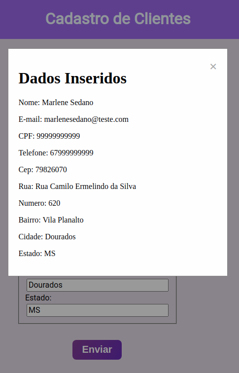

# Cadastro de Cliente - Consumindo API Cep

Este projeto foi desenvolvido para aprendizado em consumir API de Cep

## Projeto Cadastro de Cliente

Para agilizar o processo de cadatro, ao preecher o CEP, o sistema vai preencher automaticamente
os campos: Logradouro, Bairro, Cidade, UF. Caso o CEP inserido não esteja cadastro no banco de 
dados da VIA CEP, o sistema ira informar "Cep não encontrado".

## :rocket: Tecnologias

Este projeto foi desenvolvido com as seguintes tecnologias:

- HTML
- Css
- JavaScript

                                                     
## Demonstração
 


Após preencher os campos e clicar no button Enviar, o 
sistema irá mostrar uma pré-visualização dos campos em um
modal.



## Como usar

```
# Clone este repositório
$ git clone https://github.com/marlenesedano/formulario_cadastro_clientes.git

# Acesse o diretório do projeto
$ cd formulario_cadastro_clientes


